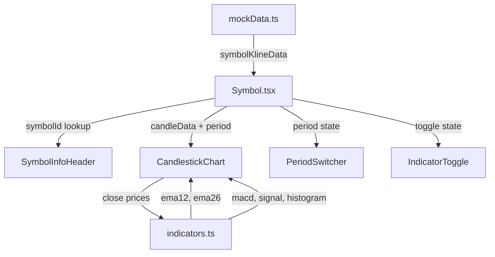

# 技术设计文档：标的详情页（Symbol Detail Page）静态 UI

## 概述

本设计文档描述 QuantBoard 应用标的详情页的静态 UI 实现方案。该页面通过路由 `/symbol/:symbolId` 访问，使用 Lightweight Charts v5 渲染专业 K 线图（CandlestickSeries），叠加 EMA 均线指标和成交量柱状图，并在下方独立区域展示 MACD 指标面板。用户可切换时间周期（1D/1W/1M）和独立开关技术指标。

本期为纯静态 UI 阶段，所有数据使用硬编码的 mock 数据，EMA 和 MACD 均在前端纯计算。页面遵循深色主题设计规范，不展示任何个人隐私信息。

### 关键设计决策

1. **单 chart 实例共享**：K 线图、成交量柱状图、EMA 均线、MACD 面板共享同一个 Lightweight Charts 实例和时间轴，通过不同的 `priceScaleId` 隔离价格轴区域。这样确保时间对齐，且减少内存占用。
2. **指标计算纯前端**：EMA 和 MACD 的计算逻辑封装在 `utils/indicators.ts` 工具模块中，基于收盘价序列纯前端计算，不依赖后端。计算函数为纯函数，便于单元测试和属性测试。
3. **动态 Series 管理**：指标开关通过动态添加/移除 Lightweight Charts 的 Series 实现，而非 CSS 隐藏。这样避免不可见 Series 占用渲染资源。
4. **Mock 数据与现有数据共存**：新增的 OHLCV 数据类型和 K 线 mock 数据追加到现有 `mockData.ts` 中，复用已有的 `marketItems` 标的列表作为查找源。
5. **MACD 独立 priceScaleId**：MACD 面板使用独立的 `priceScaleId: 'macd'`，成交量使用 `priceScaleId: 'volume'`，两者与主 K 线的默认 `right` 价格轴互不干扰。

## 架构

### 页面结构

```
Layout (已有)
└── Header (已有)
└── <Outlet />
    └── Symbol Page (本期实现)
        ├── 返回导航按钮 (← 返回)
        ├── SymbolInfoHeader          ← 标的代码、名称、价格、涨跌幅
        ├── 工具栏 (flex 一行)
        │   ├── PeriodSwitcher        ← 1D / 1W / 1M 周期切换
        │   └── IndicatorToggle       ← EMA / MACD 开关
        └── CandlestickChart 容器     ← 单个 chart 实例
            ├── CandlestickSeries     ← K 线主图
            ├── EMA LineSeries ×2     ← EMA12(蓝) + EMA26(橙)，叠加主图
            ├── Volume HistogramSeries ← 成交量柱状图，独立 priceScale
            └── MACD 区域              ← DIF线 + DEA线 + 柱状图，独立 priceScale
```

### 数据流



Symbol.tsx 作为页面容器，通过 `useParams` 获取 `symbolId`，从 mock 数据中查找对应标的的 K 线数据。页面管理三个状态：当前周期（period）、EMA 开关（showEMA）、MACD 开关（showMACD）。CandlestickChart 组件接收数据和开关状态，内部调用 `indicators.ts` 计算指标值。

### 文件结构

```
frontend/src/
├── components/
│   ├── CandlestickChart.tsx   # K 线图组件（含 EMA、Volume、MACD）
│   ├── SymbolInfoHeader.tsx   # 标的信息头部
│   ├── PeriodSwitcher.tsx     # 时间周期切换器
│   └── IndicatorToggle.tsx    # 技术指标开关
├── data/
│   └── mockData.ts            # 追加 OHLCV 类型和 K 线 mock 数据
├── pages/
│   └── Symbol.tsx             # 页面容器，组装各组件
└── utils/
    └── indicators.ts          # EMA / MACD 纯计算函数
```

## 组件与接口

### 1. Symbol.tsx（页面容器）

页面入口组件，负责数据查找、状态管理和子组件组装。

```typescript
// 页面状态
type Period = '1D' | '1W' | '1M';

// 内部状态
const [period, setPeriod] = useState<Period>('1D');
const [showEMA, setShowEMA] = useState(true);
const [showMACD, setShowMACD] = useState(true);
```

**逻辑**：
- 通过 `useParams` 获取 `symbolId`
- 从 `symbolKlineData[symbolId]` 查找 K 线数据
- 从 `marketItems` 查找标的基本信息（name、price、changePercent）
- 若 symbolId 不存在，展示"未找到该标的"提示
- 将数据和状态通过 Props 传递给子组件

### 2. SymbolInfoHeader

标的信息头部，展示基本行情信息。

```typescript
interface SymbolInfoHeaderProps {
  symbol: string;        // 标的代码
  name: string;          // 标的名称
  price: number;         // 当前价格
  changePercent: number; // 涨跌百分比
}
```

**渲染逻辑**：
- 标的代码大字体 `text-2xl font-bold text-slate-50`
- 标的名称 `text-slate-400`
- 价格 `text-3xl font-bold text-slate-50`
- 涨跌幅：正数 `text-emerald-400` 带 "+" 前缀，负数 `text-red-400`
- 背景融入页面 `bg-slate-950`

### 3. PeriodSwitcher

时间周期切换按钮组。

```typescript
type Period = '1D' | '1W' | '1M';

interface PeriodSwitcherProps {
  current: Period;
  onChange: (period: Period) => void;
}
```

**渲染逻辑**：
- 三个按钮横向排列：1D、1W、1M
- 选中态：`bg-blue-600 text-white`
- 未选中态：`bg-slate-800 text-slate-400 hover:bg-slate-700`
- 圆角按钮组样式

### 4. IndicatorToggle

技术指标开关按钮组。

```typescript
interface IndicatorToggleProps {
  showEMA: boolean;
  showMACD: boolean;
  onToggleEMA: () => void;
  onToggleMACD: () => void;
}
```

**渲染逻辑**：
- 两个独立开关按钮：EMA、MACD
- 开启态：`bg-blue-600 text-white`
- 关闭态：`bg-slate-800 text-slate-400`
- 与 PeriodSwitcher 在同一行，右侧对齐

### 5. CandlestickChart

核心图表组件，管理单个 Lightweight Charts 实例和所有 Series。

```typescript
interface CandleData {
  time: string;   // "2024-01-15" 格式
  open: number;
  high: number;
  low: number;
  close: number;
  volume: number;
}

interface CandlestickChartProps {
  data: CandleData[];
  showEMA: boolean;
  showMACD: boolean;
}
```

**渲染逻辑**：
- 使用 `createChart` 创建单个 chart 实例，深色主题配置
- 添加 CandlestickSeries 渲染 K 线主图
  - 阳线（close > open）：绿色 `#26a69a`
  - 阴线（close < open）：红色 `#ef5350`
- 添加 HistogramSeries 渲染成交量，`priceScaleId: 'volume'`
  - 成交量柱颜色跟随 K 线涨跌
  - `scaleMargins: { top: 0.8, bottom: 0 }` 压缩在底部 20% 区域
- 根据 `showEMA` 动态添加/移除两条 LineSeries
  - EMA12：蓝色 `#2962FF`，lineWidth 1
  - EMA26：橙色 `#FF6D00`，lineWidth 1
  - 与 K 线共享默认 `right` 价格轴
- 根据 `showMACD` 动态添加/移除 MACD 三条 Series
  - DIF 线：蓝色 `#2962FF` LineSeries，`priceScaleId: 'macd'`
  - DEA 线：橙色 `#FF6D00` LineSeries，`priceScaleId: 'macd'`
  - MACD 柱状图：HistogramSeries，`priceScaleId: 'macd'`，正值绿色负值红色
  - `scaleMargins: { top: 0.7, bottom: 0 }` 或类似配置
- 启用鼠标拖拽平移和滚轮缩放
- 容器宽度变化时通过 ResizeObserver 调用 `chart.applyOptions` 自适应
- 组件卸载时调用 `chart.remove()` 释放资源

### 6. indicators.ts（工具模块）

纯函数模块，封装技术指标计算逻辑。

```typescript
/**
 * 计算 EMA（指数移动平均线）
 * @param closes 收盘价序列
 * @param period EMA 周期（如 12、26）
 * @returns EMA 值序列，长度与 closes 相同，前 period-1 个值为 NaN
 */
export function calculateEMA(closes: number[], period: number): number[];

/**
 * 计算 MACD 指标
 * @param closes 收盘价序列
 * @param fastPeriod 快线周期，默认 12
 * @param slowPeriod 慢线周期，默认 26
 * @param signalPeriod 信号线周期，默认 9
 * @returns { dif: number[], dea: number[], histogram: number[] }
 */
export function calculateMACD(
  closes: number[],
  fastPeriod?: number,
  slowPeriod?: number,
  signalPeriod?: number
): { dif: number[]; dea: number[]; histogram: number[] };
```

**EMA 计算公式**：
- 乘数 `k = 2 / (period + 1)`
- `EMA[0] = closes[0]`（首个值用收盘价初始化）
- `EMA[i] = closes[i] * k + EMA[i-1] * (1 - k)`

**MACD 计算公式**：
- `DIF = EMA(closes, fastPeriod) - EMA(closes, slowPeriod)`
- `DEA = EMA(DIF, signalPeriod)`
- `Histogram = DIF - DEA`

## 数据模型

### 新增类型定义

追加到 `frontend/src/data/mockData.ts`：

```typescript
/** K 线数据（OHLCV） */
export interface CandleData {
  time: string;    // "2024-01-15" 格式，Lightweight Charts 要求
  open: number;
  high: number;
  low: number;
  close: number;
  volume: number;
}

/** 标的 K 线数据集（按周期） */
export interface SymbolKlineMap {
  '1D': CandleData[];
  '1W': CandleData[];
  '1M': CandleData[];
}

/** 所有标的的 K 线数据索引 */
export type SymbolKlineData = Record<string, SymbolKlineMap>;
```

### Mock 数据生成

新增 `generateCandleData` 函数，基于起始价格和波动率生成 OHLCV 数据：

```typescript
function generateCandleData(
  startDate: string,
  basePrice: number,
  points: number,
  volatility: number,
  intervalDays: number  // 1=日线, 7=周线, 30=月线
): CandleData[]
```

**生成逻辑**：
- 从 `startDate` 开始，每隔 `intervalDays` 天生成一根 K 线
- open = 上一根 close（首根用 basePrice）
- close = open × (1 + random × volatility)
- high = max(open, close) × (1 + random × volatility × 0.5)
- low = min(open, close) × (1 - random × volatility × 0.5)
- volume = baseVolume × (0.5 + random)

### Mock 数据覆盖

为 `marketItems` 中已有的标的提供 K 线数据：

| 标的 | 基础价格 | 波动率 | 数据点数 |
|------|----------|--------|----------|
| BTCUSDT | 64,000 | 0.03 | ≥30 |
| ETHUSDT | 3,200 | 0.035 | ≥30 |
| AAPL | 185 | 0.015 | ≥30 |
| TSLA | 230 | 0.04 | ≥30 |
| NVDA | 850 | 0.025 | ≥30 |

每个标的提供三个周期（1D、1W、1M）的独立数据集。

### 现有数据复用

- `marketItems` 中的 `symbol`、`name`、`price`、`changePercent` 用于 SymbolInfoHeader 展示
- 通过 `symbolId` 在 `marketItems` 中查找标的基本信息
- 通过 `symbolId` 在 `symbolKlineData` 中查找 K 线数据


## 正确性属性 (Correctness Properties)

*正确性属性是指在系统所有有效执行中都应保持为真的特征或行为——本质上是对系统应做什么的形式化陈述。属性是人类可读规格说明与机器可验证正确性保证之间的桥梁。*

### Property 1: SymbolInfoHeader 渲染所有必需字段

*For any* 有效的标的数据（包含 symbol、name、price、changePercent），SymbolInfoHeader 组件的渲染输出应包含该标的的代码（symbol）、名称（name）、格式化后的价格（price）和涨跌百分比（changePercent）。

**Validates: Requirements 1.2**

### Property 2: 涨跌幅颜色映射

*For any* 涨跌百分比值，当 `changePercent > 0` 时，SymbolInfoHeader 渲染的涨跌幅元素应包含 `text-emerald-400` 样式类并以 "+" 为前缀；当 `changePercent < 0` 时，应包含 `text-red-400` 样式类。

**Validates: Requirements 1.3, 1.4**

### Property 3: EMA 计算正确性

*For any* 长度 ≥ period 的正数收盘价序列和任意有效周期 period（≥1），`calculateEMA(closes, period)` 的输出应满足：
- 输出长度等于输入长度
- 每个 EMA 值都是正数（因为输入全为正数）
- EMA 值始终在输入序列的最小值和最大值之间（EMA 是加权平均，不会超出输入范围）

**Validates: Requirements 6.3**

### Property 4: MACD 柱状图不变量

*For any* 长度 ≥ 26 的正数收盘价序列，`calculateMACD(closes)` 的输出应满足不变量：对于每个索引 i，`histogram[i] === dif[i] - dea[i]`（MACD 柱状图值恒等于 DIF 减 DEA）。

**Validates: Requirements 7.4**

### Property 5: Mock 数据 OHLCV 结构完整性

*For any* mock 数据中的 CandleData 对象，应满足：
- `high >= max(open, close)` 且 `low <= min(open, close)`（最高价不低于开盘/收盘价，最低价不高于开盘/收盘价）
- `volume > 0`（成交量为正数）
- 所有价格字段（open、high、low、close）均为正数

**Validates: Requirements 9.1, 9.2**

### Property 6: 隐私合规

*For any* 有效的标的数据，Symbol 页面的渲染输出不应包含任何隐私相关字段的值（如持仓数量 quantity、持仓成本 cost、盈亏金额 pnl、盈亏百分比 pnlPercent）。页面仅展示公开市场行情数据。

**Validates: Requirements 10.1, 10.2**

### Property 7: 指标开关幂等性

*For any* 指标开关（EMA 或 MACD），连续点击两次应恢复到初始状态（开关的显示/隐藏状态与点击前相同）。即 `toggle(toggle(state)) === state`。

**Validates: Requirements 8.3**

### Property 8: MACD 柱状图颜色映射

*For any* MACD 柱状图数据点，当 `histogram > 0` 时应映射为绿色，当 `histogram < 0` 时应映射为红色。颜色映射函数对于所有有效的 histogram 值应保持一致。

**Validates: Requirements 7.5, 7.6**

## 错误处理

本期为纯静态 UI，不涉及网络请求，错误场景有限：

| 场景 | 处理方式 |
|------|----------|
| symbolId 在 mock 数据中不存在 | 展示"未找到该标的"提示文本，不渲染图表组件 |
| Mock 数据为空数组 | CandlestickChart 不渲染任何 Series，展示空图表 |
| 图表容器尺寸为 0 | 创建 chart 前检查容器尺寸，避免 Lightweight Charts 异常 |
| Lightweight Charts 实例泄漏 | useEffect cleanup 中调用 `chart.remove()` 销毁实例 |
| EMA/MACD 输入数据不足 | 当收盘价序列长度不足时，指标计算函数返回空数组，不渲染对应 Series |
| ResizeObserver 回调异常 | 使用 try-catch 包裹 resize 处理逻辑 |

## 测试策略

### 测试框架选择

- **单元测试 / 组件测试**：Vitest + React Testing Library
- **属性测试 (Property-Based Testing)**：[fast-check](https://github.com/dubzzz/fast-check)（已安装在 devDependencies 中）
- **测试运行**：`vitest --run`（单次执行，非 watch 模式）

### 测试分层

#### 单元测试（具体示例与边界情况）

- symbolId 不存在时展示"未找到该标的"提示（验证需求 1.5）
- 每个周期的 mock 数据至少包含 30 根 K 线（验证需求 2.2）
- PeriodSwitcher 提供 1D、1W、1M 三个选项（验证需求 4.1）
- PeriodSwitcher 默认选中 1D（验证需求 4.4）
- 页面包含返回导航按钮（验证需求 5.2）
- EMA 默认展示 EMA12 和 EMA26 两条线（验证需求 6.2）
- MACD 使用标准参数 12/26/9（验证需求 7.3）
- IndicatorToggle 提供 EMA 和 MACD 两个开关（验证需求 8.1）
- IndicatorToggle 默认开启 EMA 和 MACD（验证需求 8.2）
- mock 数据为三个周期提供独立数据集（验证需求 9.3）
- mock 数据覆盖 marketItems 中已有标的（验证需求 9.4）
- 组件卸载时调用 chart.remove()（验证需求 2.7）

#### 属性测试（通用属性，跨所有输入验证）

每个属性测试最少运行 100 次迭代。每个测试必须通过注释引用设计文档中的属性编号。每个正确性属性由单个属性测试实现。

- **Feature: symbol-detail-page, Property 1: SymbolInfoHeader 渲染所有必需字段** — 生成随机标的数据，验证渲染输出包含 symbol、name、price、changePercent
- **Feature: symbol-detail-page, Property 2: 涨跌幅颜色映射** — 生成随机 changePercent 值，验证正数对应 emerald + "+" 前缀、负数对应 red
- **Feature: symbol-detail-page, Property 3: EMA 计算正确性** — 生成随机正数收盘价序列和有效周期，验证 EMA 输出长度、正数性和范围约束
- **Feature: symbol-detail-page, Property 4: MACD 柱状图不变量** — 生成随机正数收盘价序列，验证 histogram[i] === dif[i] - dea[i]
- **Feature: symbol-detail-page, Property 5: Mock 数据 OHLCV 结构完整性** — 验证所有 mock 数据满足 high ≥ max(open,close)、low ≤ min(open,close)、volume > 0
- **Feature: symbol-detail-page, Property 6: 隐私合规** — 生成包含隐私字段的随机数据，验证渲染输出不包含隐私值
- **Feature: symbol-detail-page, Property 7: 指标开关幂等性** — 生成随机初始状态，验证双击后恢复原始状态
- **Feature: symbol-detail-page, Property 8: MACD 柱状图颜色映射** — 生成随机 histogram 值，验证正值映射绿色、负值映射红色

### 测试配置要求

- 每个属性测试使用 `fc.assert(fc.property(...), { numRuns: 100 })` 配置
- 每个属性测试文件头部注释引用对应的设计属性：`// Feature: symbol-detail-page, Property N: {property_text}`
- 单元测试和属性测试互补：单元测试覆盖具体示例和边界情况，属性测试覆盖通用规则
